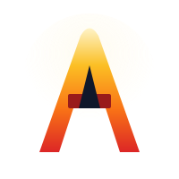

<p align="center">
  
</p>

<h1 align="center">Anvil</h1>

<p align="center">
  <a href="https://github.com/kafkade/anvil/actions/workflows/ci.yml"></a>
  <a href="https://github.com/kafkade/anvil/releases"></a>
  <a href="LICENSE-MIT"></a>
  <a href="https://www.rust-lang.org/"></a>
  <a href="https://github.com/sponsors/kafkade"></a>
</p>

<p align="center"><strong>Declarative Workstation Configuration Management</strong></p>

Anvil is a declarative configuration management tool for developer workstations. Define your development environment in YAML, and Anvil will install packages, copy configuration files, run setup scripts, and verify system health. Currently supports Windows (winget), with cross-platform support planned.

## ✨ Features

- 📦 **Package Management** - Install software via winget with version pinning
- 📁 **File Synchronization** - Copy configuration files with automatic backup
- 🔧 **Script Execution** - Run PowerShell setup and validation scripts
- 🧬 **Workload Inheritance** - Compose configurations using DRY principles
- ✅ **Health Checks** - Validate system state matches workload definition
- 🔍 **Assertions & Conditions** - Declarative system state predicates for health validation
- 📊 **Multiple Formats** - Output as table, JSON, YAML, or HTML reports
- 🔄 **Backup & Restore** - Save and restore system state
- 🐚 **Shell Completions** - Tab completion for PowerShell, Bash, Zsh, Fish
- 🌐 **Multi-Platform Design** - Windows support now; macOS and Linux on the roadmap

## 🚀 Quick Start

### Installation

**Option 1: Install from crates.io**

```powershell
# Prerequisites: Rust 1.75+
cargo install anvil-cli
```

**Option 2: Download from Releases**

```powershell
# Download latest release
Invoke-WebRequest -Uri "https://github.com/kafkade/anvil/releases/latest/download/anvil-windows-x64.zip" -OutFile anvil.zip
Expand-Archive anvil.zip -DestinationPath C:\Tools\anvil
$env:PATH += ";C:\Tools\anvil"
```

**Option 3: Build from Source**

```powershell
# Prerequisites: Rust 1.75+
git clone https://github.com/kafkade/anvil.git
cd anvil
cargo build --release
# Binary is at target/release/anvil.exe
```

### Basic Usage

```powershell
# List available workloads
anvil list

# Preview what would happen
anvil install rust-developer --dry-run

# Install a workload
anvil install rust-developer

# Check system health
anvil health rust-developer

# Generate HTML health report
anvil health rust-developer --output html --file report.html
```

## 📦 Bundled Workloads

| Workload | Description |
|----------|-------------|
| `essentials` | Core development tools (VS Code, Git, Windows Terminal) and productivity utilities |
| `rust-developer` | Rust toolchain with cargo tools (extends essentials) |
| `python-developer` | Python 3.12 with uv package manager (extends essentials) |

## 📋 Workload Structure

A workload is a configuration bundle:

```
my-workload/
├── workload.yaml       # Workload definition
├── files/              # Configuration files to deploy
└── scripts/            # Installation and health scripts
```

### Example Workload

```yaml
name: rust-developer
version: "1.0.0"
description: "Complete Rust development environment"

extends:
  - essentials

packages:
  winget:
    - id: Rustlang.Rustup
    - id: LLVM.LLVM

files:
  - source: config.toml
    destination: "~/.cargo/config.toml"
    backup: true

scripts:
  post_install:
    - path: scripts/setup.ps1
      description: "Install Rust components"
      
  health_check:
    - path: scripts/health.ps1
      name: "Rust Toolchain"
```

## 🔧 CLI Reference

```
anvil <COMMAND>

Commands:
  install      Apply a workload configuration
  health       Validate system against workload
  list         List available workloads
  show         Display workload details
  validate     Validate workload syntax
  init         Create new workload template
  status       Show installation status
  backup       Manage file backups
  config       Manage global configuration
  completions  Generate shell completions

Global Options:
  -v, --verbose    Increase verbosity (-v, -vv, -vvv)
  -q, --quiet      Suppress output
  -c, --config     Use custom configuration file
      --no-color   Disable colored output
  -h, --help       Show help
  -V, --version    Show version
```

## 📚 Documentation

| Document | Description |
|----------|-------------|
| [User Guide](https://anvil.kafkade.com/user-guide.html) | Complete usage instructions |
| [Workload Authoring](https://anvil.kafkade.com/workload-authoring.html) | Creating custom workloads |
| [Troubleshooting](https://anvil.kafkade.com/troubleshooting.html) | Common issues and solutions |
| [Specification](https://anvil.kafkade.com/specification.html) | Technical spec and roadmap |
| [Architecture](https://anvil.kafkade.com/architecture.html) | Internal code architecture |
| [Contributing](CONTRIBUTING.md) | Contribution guidelines |
| [Changelog](CHANGELOG.md) | Version history |

## ⚙️ Requirements

**Current platform support: Windows**

- Windows 10 (version 1809+) or Windows 11
- [Windows Package Manager (winget)](https://github.com/microsoft/winget-cli)
- PowerShell 5.1 or later

> Cross-platform support (macOS via Homebrew, Linux via APT) is on the [roadmap](https://anvil.kafkade.com/specification.html#8-roadmap).

## 🛠️ Building from Source

### Prerequisites

- Rust 1.75 or later
- Visual Studio Build Tools (for Windows linking)

### Build

```powershell
# Debug build
cargo build

# Release build (optimized)
cargo build --release

# Run tests
cargo test

# Run with verbose output
cargo run -- -vvv list
```

## 🤝 Contributing

Contributions are welcome! Please read our [Contributing Guide](CONTRIBUTING.md) for details on:

- Reporting bugs
- Suggesting features
- Submitting pull requests
- Creating workloads

## 📄 License

This project is dual-licensed under [MIT](LICENSE-MIT) and [Apache-2.0](LICENSE-APACHE).

## 🙏 Acknowledgments

- [winget](https://github.com/microsoft/winget-cli) - Windows Package Manager
- [clap](https://github.com/clap-rs/clap) - Command line argument parser
- [serde](https://github.com/serde-rs/serde) - Serialization framework
- [handlebars](https://github.com/sunng87/handlebars-rust) - Template engine

---

<p align="center">
  Made with ❤️ for developers
</p>